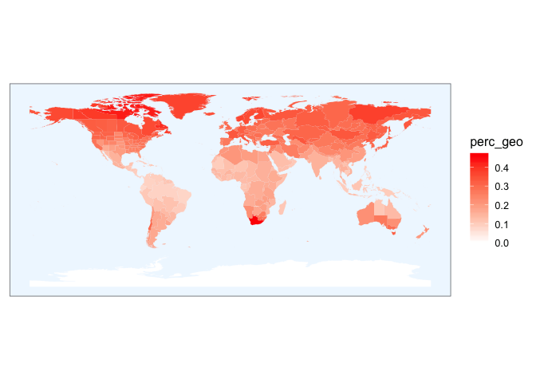

Supplemental Materials S2: Geophyte diversity plots
================
11/01/2018

Introduction
============

Data
----

This script will use data from the [Kew Checklist of Selected Plant Families (WCSP)](http://wcsp.science.kew.org/) to examine geophyte diversity around the globe. These data were provided by Rafaël Govaerts from WCSP. Please [contact the WCSP](http://wcsp.science.kew.org/contact.do) if you would like a copy of the data; an example of these data can be found [here](http://wcsp.science.kew.org/namedetail.do?name_id=461103). The two-sheet dataset contains species or infraspecifc data on seed plants. The first sheet contains taxonomic and lifeform data on each plant. The second sheet includes information on the range of the plants. These two sheets are linked by a plant ID number. The data resolution is to the species level or variety/ subspecies level. We have left the data mixed like this, so our units are not in described species, but to the smallest rank available.

Not all plants are represented in this dataset. It currently contains 217 seed plant families. At the end of the document, we show which seed plant families are not represented in the dataset and their taxonomic ranks; this should help us decide to what extent the checklist data is biased.

In these analyses, we will examine:
-----------------------------------

1.  Of the plants in the dataset, what percentage are geophytes?

2.  Where are there hotspots of geophyte diversity around the globe?

3.  How representative is this dataset of all seed plants?

Set up and loading in data
==========================

We will read in the checklist data and identify which plants are geophytes. Here we are excluding pseudobulbs from our analysis because we do not include them in our definition of 'geophyte'.

``` r
data <- read_csv("../lifeform_fig/AcceptedNames_edited.csv")

data$geophyte <- grepl("geophyte", data$Lifeform_abbreviation, fixed = T)

data$psuedobulb <- grepl("Pseudobulb", data$Lifeform_abbreviation, fixed = T)

data$geo_not_pseudo <- data$geophyte == T & data$psuedobulb == F
```

Of the plants in the dataset, what percentage are geophytes?
============================================================

``` r
round(100*sum(data$geo_not_pseudo)/length(data$geo_not_pseudo), digits = 2) 
```

    ## [1] 18.01

Where are there hotspots of geophyte diversity around the globe?
================================================================

The finest spatial resolution available for these data is the third level of 'botanical countries,' defined by TWDG codes. A world map with polygons that correspond to these regions is available on the Kew website: <https://www.kew.org/gis/tdwg/> Here, we show a map where the polygons of regions are colored by geophyte diversity.

Read in the location data sheet and the shapefile, and combine all data into a longform data frame that ggplot2 can read.

``` r
read_csv("../lifeform_fig/AcceptedNameLocations.csv") %>%
  left_join(data, by = c("Plant_name_id" = "accPlant_name_id")) %>%
  group_by(Area_code_L3) %>%
  summarise(geophytes_in_region = sum(geo_not_pseudo, na.rm = TRUE),
            total_plants_in_region = n(),
            perc_geo = sum(geo_not_pseudo, na.rm = TRUE)/n()) -> geos_by_region

l3_map <- readShapePoly("../lifeform_fig/level3/level3.shp")

l3_map@data %>%
  left_join(geos_by_region, by = c("LEVEL3_COD" = "Area_code_L3")) %>%
  mutate(id = rownames(.),
         geo_density = geophytes_in_region/area(l3_map)) -> l3_map@data

fortify(l3_map, region="id") %>% 
  left_join(l3_map@data, by="id") -> l3_map.df
```

Regions colored by the percent of plants that are geophytes
-----------------------------------------------------------

``` r
ggplot(l3_map.df) + 
  geom_polygon(aes(x = long, y = lat, group = group, fill = perc_geo)) +
  coord_equal() +
  scale_fill_gradient(low = "white", high = "red") +
  theme_few() + 
  theme(axis.line=element_blank(),axis.text.x=element_blank(),
        axis.text.y=element_blank(),axis.ticks=element_blank(),
        axis.title.x=element_blank(),
        axis.title.y=element_blank(),
        panel.background = element_rect(fill = "aliceblue",
                                        colour = "aliceblue",
                                        size = 0.5, linetype = "solid"))
```



How biased are the checklist data?
==================================

The checklist of selected plant families does not represent all seed plant families. If the families included are nonrandom with respect to the number of geophytes, our estimates may be biased. Here, we show which families of seed plants are not in the checklist data, and examine their taxonomy.

Which families are not represented in the checklist data?
---------------------------------------------------------

Import a list of all seed plant families from theplantlist.org.

``` r
all_families <- colnames(read_csv("../lifeform_fig/families.csv"))

in_checklist_not_in_all <- 
  unique(data$accFamily)[! unique(data$accFamily) %in% all_families]

in_all_not_in_checklist <- 
  all_families[! all_families %in% unique(data$accFamily)]
```

### The following families are in the checklist data but not the plantlist.org data:

Toricelliaceae, Nyssaceae, Asphodelaceae, Ripogonaceae, Campynemataceae, Maundiaceae, Sciadopityaceae, Anacampserotaceae, Kewaceae, Petenaeaceae, Trimeniaceae, Unplaced, Tetracarpaeaceae

### The following families are in the plantlist.org data but not the checklist data:

Actinidiaceae, Adoxaceae, Aizoaceae, Alseuosmiaceae, Amaranthaceae, Anacardiaceae, Anarthriaceae, Anisophylleaceae, Annonaceae, Aphanopetalaceae, Aphloiaceae, Apiaceae, Apodanthaceae, Aquifoliaceae, Argophyllaceae, Atherospermataceae, Balanophoraceae, Balsaminaceae, Berberidaceae, Bonnetiaceae, Boraginaceae, Brassicaceae, Bruniaceae, Burseraceae, Cactaceae, Calceolariaceae, Calophyllaceae, Calyceraceae, Campyneumataceae, Cannabaceae, Capparaceae, Caprifoliaceae, Caricaceae, Caryophyllaceae, Centrolepidaceae, Chloranthaceae, Cistaceae, Cleomaceae, Clusiaceae, Combretaceae, Compositae, Connaraceae, Crassulaceae, Crossosomataceae, Cucurbitaceae, Cyrillaceae, Cytinaceae, Datiscaceae, Diapensiaceae, Dichapetalaceae, Dilleniaceae, Dipterocarpaceae, Dirachmaceae, Elaeagnaceae, Elaeocarpaceae, Ericaceae, Erythroxylaceae, Escalloniaceae, Frankeniaceae, Geissolomataceae, Gelsemiaceae, Gentianaceae, Geraniaceae, Gesneriaceae, Goodeniaceae, Goupiaceae, Grossulariaceae, Gyrostemonaceae, Halophytaceae, Haloragaceae, Hamamelidaceae, Haptanthaceae, Hernandiaceae, Huaceae, Humiriaceae, Hydnoraceae, Hydrangeaceae, Hydroleaceae, Hydrostachyaceae, Icacinaceae, Iteaceae, Ixonanthaceae, Juglandaceae, Kirkiaceae, Koeberliniaceae, Krameriaceae, Lacistemataceae, Lactoridaceae, Lauraceae, Leguminosae, Lepidobotryaceae, Limeaceae, Limnanthaceae, Linaceae, Linderniaceae, Loasaceae, Loganiaceae, Lophiocarpaceae, Loranthaceae, Lythraceae, Malpighiaceae, Malvaceae, Marcgraviaceae, Martyniaceae, Melastomataceae, Meliaceae, Melianthaceae, Menispermaceae, Menyanthaceae, Metteniusaceae, Misodendraceae, Mitrastemonaceae, Molluginaceae, Monimiaceae, Montiaceae, Montiniaceae, Moraceae, Moringaceae, Muntingiaceae, Myricaceae, Myristicaceae, Myrothamnaceae, Nelumbonaceae, Nepenthaceae, Neuradaceae, Nitrariaceae, Nyctaginaceae, Nymphaeaceae, Ochnaceae, Olacaceae, Onagraceae, Oncothecaceae, Oxalidaceae, Papaveraceae, Passifloraceae, Paulowniaceae, Pedaliaceae, Penaeaceae, Pentadiplandraceae, Pentaphragmataceae, Pentaphylacaceae, Penthoraceae, Peridiscaceae, Phyllonomaceae, Picramniaceae, Piperaceae, Pittosporaceae, Platanaceae, Plocospermataceae, Plumbaginaceae, Podostemaceae, Polemoniaceae, Polygalaceae, Polygonaceae, Portulacaceae, Primulaceae, Proteaceae, Quillajaceae, Rafflesiaceae, Ranunculaceae, Resedaceae, Rhabdodendraceae, Rhamnaceae, Rhipogonaceae, Roridulaceae, Rosaceae, Rousseaceae, Sabiaceae, Salvadoraceae, Santalaceae, Sapindaceae, Sarcobataceae, Sarraceniaceae, Saxifragaceae, Schoepfiaceae, Scrophulariaceae, Setchellanthaceae, Simaroubaceae, Simmondsiaceae, Siparunaceae, Sladeniaceae, Solanaceae, Sphenocleaceae, Stachyuraceae, Staphyleaceae, Stegnospermataceae, Stemonuraceae, Strasburgeriaceae, Stylidiaceae, Styracaceae, Surianaceae, Symplocaceae, Talinaceae, Tamaricaceae, Tapisciaceae, Tetramelaceae, Tetrameristaceae, Theaceae, Thomandersiaceae, Thymelaeaceae, Torricelliaceae, Tovariaceae, Trigoniaceae, Trochodendraceae, Tropaeolaceae, Ulmaceae, Urticaceae, Vahliaceae, Vitaceae, Vivianiaceae, Vochysiaceae, Winteraceae, Xanthorrhoeaceae, Boweniaceae, Cephalotaxaceae, Taxodiaceae

To examine the broader classification of these families, we will download their taxonomy using NCBI taxonomy.

``` r
# API key for NCBI
ENTREZ_KEY <- getkey(x = "efcbd6b960ced6685f1f4c07c65b020f5208", 
                     service = "entrez")

# get taxa ids for the families from NCBI
# uids <- get_uid(in_all_not_in_checklist)

# rate limit function to avoid api limits being exceeded
# classification_lim <- limit_rate(f = classification,       
#                                  rate(n = 10, period = 1)) 

# get the classification from NCBI (but rate limited)
# out <- classification_lim(uids, db = "ncbi") 

# do this once and save, then reload for knitting doc
# save(out, file = "out.RData")

load("../lifeform_fig/out.RData")
```

Now, we will create a dataframe with the data arranged by family, with columns containing information on their higher order taxonomy.

``` r
taxon_info <- data.frame(family = in_all_not_in_checklist,
                         order = character(length = length(in_all_not_in_checklist)),
                         subclass = character(length = length(in_all_not_in_checklist)),
                         eudicot = logical(length = length(in_all_not_in_checklist)),
                         monocot = logical(length = length(in_all_not_in_checklist)),
                         #ANA = logical(length = length(in_all_not_in_checklist)),
                         gymno  = logical(length = length(in_all_not_in_checklist)),
                         stringsAsFactors=FALSE)


for (i in 1:nrow(taxon_info)) {
  
  if (is.na(out[[i]]) == F) {
    
    if(sum(grepl("order", out[[i]]$rank)) == 1) {
      taxon_info[i,"order"] <- out[[i]][which(out[[i]]$rank == "order"),"name"] 
    } else  {taxon_info[i,"order"] <- NA}
    
    if(sum(grepl("subclass", out[[i]]$rank)) == 1) {
      taxon_info[i,"subclass"] <- out[[i]][which(out[[i]]$rank == "subclass"),"name"] 
    } else  {taxon_info[i,"subclass"] <- NA}
    
    taxon_info[i, "eudicot"] <- sum(grepl("eudicotyledons", out[[i]][,"name"])) == 1
    taxon_info[i, "monocot"] <- sum(grepl("Liliopsida", out[[i]][,"name"])) == 1
    taxon_info[i, "gymno"] <- sum(grepl("Acrogymnospermae", out[[i]][,"name"])) == 1
  } else {
    
    taxon_info[i,"order"] <- NA
    taxon_info[i,"subclass"] <- NA
    taxon_info[i, "eudicot"] <- NA
    taxon_info[i, "monocot"] <- NA
    taxon_info[i, "gymno"] <- NA
  }
  
}

kable(taxon_info, caption = "Taxonomic information on familiest that are NOT included in the Kew Checklist of Selected Plant Families.")
```

| family             | order           | subclass      | eudicot | monocot | gymno |
|:-------------------|:----------------|:--------------|:--------|:--------|:------|
| Actinidiaceae      | Ericales        | asterids      | TRUE    | FALSE   | FALSE |
| Adoxaceae          | Dipsacales      | asterids      | TRUE    | FALSE   | FALSE |
| Aizoaceae          | Caryophyllales  | NA            | TRUE    | FALSE   | FALSE |
| Alseuosmiaceae     | Asterales       | asterids      | TRUE    | FALSE   | FALSE |
| Amaranthaceae      | Caryophyllales  | NA            | TRUE    | FALSE   | FALSE |
| Anacardiaceae      | Sapindales      | rosids        | TRUE    | FALSE   | FALSE |
| Anarthriaceae      | Poales          | Petrosaviidae | FALSE   | TRUE    | FALSE |
| Anisophylleaceae   | Cucurbitales    | rosids        | TRUE    | FALSE   | FALSE |
| Annonaceae         | Magnoliales     | NA            | FALSE   | FALSE   | FALSE |
| Aphanopetalaceae   | Saxifragales    | NA            | TRUE    | FALSE   | FALSE |
| Aphloiaceae        | Crossosomatales | rosids        | TRUE    | FALSE   | FALSE |
| Apiaceae           | NA              | asterids      | TRUE    | FALSE   | FALSE |
| Apodanthaceae      | Cucurbitales    | rosids        | TRUE    | FALSE   | FALSE |
| Aquifoliaceae      | Aquifoliales    | asterids      | TRUE    | FALSE   | FALSE |
| Argophyllaceae     | Asterales       | asterids      | TRUE    | FALSE   | FALSE |
| Atherospermataceae | Laurales        | NA            | FALSE   | FALSE   | FALSE |
| Balanophoraceae    | Santalales      | NA            | TRUE    | FALSE   | FALSE |
| Balsaminaceae      | Ericales        | asterids      | TRUE    | FALSE   | FALSE |
| Berberidaceae      | Ranunculales    | NA            | FALSE   | FALSE   | FALSE |
| Bonnetiaceae       | Malpighiales    | rosids        | TRUE    | FALSE   | FALSE |
| Boraginaceae       | Boraginales     | asterids      | TRUE    | FALSE   | FALSE |
| Brassicaceae       | Brassicales     | rosids        | TRUE    | FALSE   | FALSE |
| Bruniaceae         | Bruniales       | asterids      | TRUE    | FALSE   | FALSE |
| Burseraceae        | Sapindales      | rosids        | TRUE    | FALSE   | FALSE |
| Cactaceae          | NA              | NA            | TRUE    | FALSE   | FALSE |
| Calceolariaceae    | Lamiales        | asterids      | TRUE    | FALSE   | FALSE |
| Calophyllaceae     | Malpighiales    | rosids        | TRUE    | FALSE   | FALSE |
| Calyceraceae       | Asterales       | asterids      | TRUE    | FALSE   | FALSE |
| Campyneumataceae   | NA              | NA            | NA      | NA      | NA    |
| Cannabaceae        | Rosales         | rosids        | TRUE    | FALSE   | FALSE |
| Capparaceae        | Brassicales     | rosids        | TRUE    | FALSE   | FALSE |
| Caprifoliaceae     | Dipsacales      | asterids      | TRUE    | FALSE   | FALSE |
| Caricaceae         | Brassicales     | rosids        | TRUE    | FALSE   | FALSE |
| Caryophyllaceae    | Caryophyllales  | NA            | TRUE    | FALSE   | FALSE |
| Centrolepidaceae   | Poales          | Petrosaviidae | FALSE   | TRUE    | FALSE |
| Chloranthaceae     | Chloranthales   | NA            | FALSE   | FALSE   | FALSE |
| Cistaceae          | Malvales        | rosids        | TRUE    | FALSE   | FALSE |
| Cleomaceae         | Brassicales     | rosids        | TRUE    | FALSE   | FALSE |
| Clusiaceae         | Malpighiales    | rosids        | TRUE    | FALSE   | FALSE |
| Combretaceae       | Myrtales        | rosids        | TRUE    | FALSE   | FALSE |
| Compositae         | Asterales       | asterids      | TRUE    | FALSE   | FALSE |
| Connaraceae        | Oxalidales      | rosids        | TRUE    | FALSE   | FALSE |
| Crassulaceae       | Saxifragales    | NA            | TRUE    | FALSE   | FALSE |
| Crossosomataceae   | Crossosomatales | rosids        | TRUE    | FALSE   | FALSE |
| Cucurbitaceae      | Cucurbitales    | rosids        | TRUE    | FALSE   | FALSE |
| Cyrillaceae        | Ericales        | asterids      | TRUE    | FALSE   | FALSE |
| Cytinaceae         | Malvales        | rosids        | TRUE    | FALSE   | FALSE |
| Datiscaceae        | Cucurbitales    | rosids        | TRUE    | FALSE   | FALSE |
| Diapensiaceae      | Ericales        | asterids      | TRUE    | FALSE   | FALSE |
| Dichapetalaceae    | Malpighiales    | rosids        | TRUE    | FALSE   | FALSE |
| Dilleniaceae       | Dilleniales     | NA            | TRUE    | FALSE   | FALSE |
| Dipterocarpaceae   | Malvales        | rosids        | TRUE    | FALSE   | FALSE |
| Dirachmaceae       | Rosales         | rosids        | TRUE    | FALSE   | FALSE |
| Elaeagnaceae       | Rosales         | rosids        | TRUE    | FALSE   | FALSE |
| Elaeocarpaceae     | Oxalidales      | rosids        | TRUE    | FALSE   | FALSE |
| Ericaceae          | Ericales        | asterids      | TRUE    | FALSE   | FALSE |
| Erythroxylaceae    | Malpighiales    | rosids        | TRUE    | FALSE   | FALSE |
| Escalloniaceae     | Escalloniales   | asterids      | TRUE    | FALSE   | FALSE |
| Frankeniaceae      | Caryophyllales  | NA            | TRUE    | FALSE   | FALSE |
| Geissolomataceae   | Crossosomatales | rosids        | TRUE    | FALSE   | FALSE |
| Gelsemiaceae       | Gentianales     | asterids      | TRUE    | FALSE   | FALSE |
| Gentianaceae       | Gentianales     | asterids      | TRUE    | FALSE   | FALSE |
| Geraniaceae        | Geraniales      | rosids        | TRUE    | FALSE   | FALSE |
| Gesneriaceae       | Lamiales        | asterids      | TRUE    | FALSE   | FALSE |
| Goodeniaceae       | Asterales       | asterids      | TRUE    | FALSE   | FALSE |
| Goupiaceae         | Malpighiales    | rosids        | TRUE    | FALSE   | FALSE |
| Grossulariaceae    | Saxifragales    | NA            | TRUE    | FALSE   | FALSE |
| Gyrostemonaceae    | Brassicales     | rosids        | TRUE    | FALSE   | FALSE |
| Halophytaceae      | NA              | NA            | TRUE    | FALSE   | FALSE |
| Haloragaceae       | Saxifragales    | NA            | TRUE    | FALSE   | FALSE |
| Hamamelidaceae     | Saxifragales    | NA            | TRUE    | FALSE   | FALSE |
| Haptanthaceae      | Buxales         | NA            | FALSE   | FALSE   | FALSE |
| Hernandiaceae      | Laurales        | NA            | FALSE   | FALSE   | FALSE |
| Huaceae            | Oxalidales      | rosids        | TRUE    | FALSE   | FALSE |
| Humiriaceae        | Malpighiales    | rosids        | TRUE    | FALSE   | FALSE |
| Hydnoraceae        | Piperales       | NA            | FALSE   | FALSE   | FALSE |
| Hydrangeaceae      | Cornales        | asterids      | TRUE    | FALSE   | FALSE |
| Hydroleaceae       | Solanales       | asterids      | TRUE    | FALSE   | FALSE |
| Hydrostachyaceae   | Cornales        | asterids      | TRUE    | FALSE   | FALSE |
| Icacinaceae        | Icacinales      | asterids      | TRUE    | FALSE   | FALSE |
| Iteaceae           | Saxifragales    | NA            | TRUE    | FALSE   | FALSE |
| Ixonanthaceae      | Malpighiales    | rosids        | TRUE    | FALSE   | FALSE |
| Juglandaceae       | Fagales         | rosids        | TRUE    | FALSE   | FALSE |
| Kirkiaceae         | Sapindales      | rosids        | TRUE    | FALSE   | FALSE |
| Koeberliniaceae    | Brassicales     | rosids        | TRUE    | FALSE   | FALSE |
| Krameriaceae       | Zygophyllales   | rosids        | TRUE    | FALSE   | FALSE |
| Lacistemataceae    | Malpighiales    | rosids        | TRUE    | FALSE   | FALSE |
| Lactoridaceae      | Piperales       | NA            | FALSE   | FALSE   | FALSE |
| Lauraceae          | Laurales        | NA            | FALSE   | FALSE   | FALSE |
| Leguminosae        | Fabales         | rosids        | TRUE    | FALSE   | FALSE |
| Lepidobotryaceae   | Celastrales     | rosids        | TRUE    | FALSE   | FALSE |
| Limeaceae          | Caryophyllales  | NA            | TRUE    | FALSE   | FALSE |
| Limnanthaceae      | Brassicales     | rosids        | TRUE    | FALSE   | FALSE |
| Linaceae           | Malpighiales    | rosids        | TRUE    | FALSE   | FALSE |
| Linderniaceae      | Lamiales        | asterids      | TRUE    | FALSE   | FALSE |
| Loasaceae          | Cornales        | asterids      | TRUE    | FALSE   | FALSE |
| Loganiaceae        | Gentianales     | asterids      | TRUE    | FALSE   | FALSE |
| Lophiocarpaceae    | Caryophyllales  | NA            | TRUE    | FALSE   | FALSE |
| Loranthaceae       | Santalales      | NA            | TRUE    | FALSE   | FALSE |
| Lythraceae         | Myrtales        | rosids        | TRUE    | FALSE   | FALSE |
| Malpighiaceae      | Malpighiales    | rosids        | TRUE    | FALSE   | FALSE |
| Malvaceae          | Malvales        | rosids        | TRUE    | FALSE   | FALSE |
| Marcgraviaceae     | Ericales        | asterids      | TRUE    | FALSE   | FALSE |
| Martyniaceae       | Lamiales        | asterids      | TRUE    | FALSE   | FALSE |
| Melastomataceae    | Myrtales        | rosids        | TRUE    | FALSE   | FALSE |
| Meliaceae          | Sapindales      | rosids        | TRUE    | FALSE   | FALSE |
| Melianthaceae      | Geraniales      | rosids        | TRUE    | FALSE   | FALSE |
| Menispermaceae     | Ranunculales    | NA            | FALSE   | FALSE   | FALSE |
| Menyanthaceae      | Asterales       | asterids      | TRUE    | FALSE   | FALSE |
| Metteniusaceae     | Metteniusales   | asterids      | TRUE    | FALSE   | FALSE |
| Misodendraceae     | Santalales      | NA            | TRUE    | FALSE   | FALSE |
| Mitrastemonaceae   | Ericales        | asterids      | TRUE    | FALSE   | FALSE |
| Molluginaceae      | Caryophyllales  | NA            | TRUE    | FALSE   | FALSE |
| Monimiaceae        | Laurales        | NA            | FALSE   | FALSE   | FALSE |
| Montiaceae         | NA              | NA            | TRUE    | FALSE   | FALSE |
| Montiniaceae       | Solanales       | asterids      | TRUE    | FALSE   | FALSE |
| Moraceae           | Rosales         | rosids        | TRUE    | FALSE   | FALSE |
| Moringaceae        | Brassicales     | rosids        | TRUE    | FALSE   | FALSE |
| Muntingiaceae      | Malvales        | rosids        | TRUE    | FALSE   | FALSE |
| Myricaceae         | Fagales         | rosids        | TRUE    | FALSE   | FALSE |
| Myristicaceae      | Magnoliales     | NA            | FALSE   | FALSE   | FALSE |
| Myrothamnaceae     | Gunnerales      | NA            | TRUE    | FALSE   | FALSE |
| Nelumbonaceae      | Proteales       | NA            | FALSE   | FALSE   | FALSE |
| Nepenthaceae       | Caryophyllales  | NA            | TRUE    | FALSE   | FALSE |
| Neuradaceae        | Malvales        | rosids        | TRUE    | FALSE   | FALSE |
| Nitrariaceae       | Sapindales      | rosids        | TRUE    | FALSE   | FALSE |
| Nyctaginaceae      | Caryophyllales  | NA            | TRUE    | FALSE   | FALSE |
| Nymphaeaceae       | Nymphaeales     | NA            | FALSE   | FALSE   | FALSE |
| Ochnaceae          | Malpighiales    | rosids        | TRUE    | FALSE   | FALSE |
| Olacaceae          | Santalales      | NA            | TRUE    | FALSE   | FALSE |
| Onagraceae         | Myrtales        | rosids        | TRUE    | FALSE   | FALSE |
| Oncothecaceae      | Icacinales      | asterids      | TRUE    | FALSE   | FALSE |
| Oxalidaceae        | Oxalidales      | rosids        | TRUE    | FALSE   | FALSE |
| Papaveraceae       | Ranunculales    | NA            | FALSE   | FALSE   | FALSE |
| Passifloraceae     | Malpighiales    | rosids        | TRUE    | FALSE   | FALSE |
| Paulowniaceae      | Lamiales        | asterids      | TRUE    | FALSE   | FALSE |
| Pedaliaceae        | Lamiales        | asterids      | TRUE    | FALSE   | FALSE |
| Penaeaceae         | Myrtales        | rosids        | TRUE    | FALSE   | FALSE |
| Pentadiplandraceae | Brassicales     | rosids        | TRUE    | FALSE   | FALSE |
| Pentaphragmataceae | Asterales       | asterids      | TRUE    | FALSE   | FALSE |
| Pentaphylacaceae   | Ericales        | asterids      | TRUE    | FALSE   | FALSE |
| Penthoraceae       | Saxifragales    | NA            | TRUE    | FALSE   | FALSE |
| Peridiscaceae      | Saxifragales    | NA            | TRUE    | FALSE   | FALSE |
| Phyllonomaceae     | Aquifoliales    | asterids      | TRUE    | FALSE   | FALSE |
| Picramniaceae      | Picramniales    | rosids        | TRUE    | FALSE   | FALSE |
| Piperaceae         | Piperales       | NA            | FALSE   | FALSE   | FALSE |
| Pittosporaceae     | NA              | asterids      | TRUE    | FALSE   | FALSE |
| Platanaceae        | Proteales       | NA            | FALSE   | FALSE   | FALSE |
| Plocospermataceae  | Lamiales        | asterids      | TRUE    | FALSE   | FALSE |
| Plumbaginaceae     | Caryophyllales  | NA            | TRUE    | FALSE   | FALSE |
| Podostemaceae      | Malpighiales    | rosids        | TRUE    | FALSE   | FALSE |
| Polemoniaceae      | Ericales        | asterids      | TRUE    | FALSE   | FALSE |
| Polygalaceae       | Fabales         | rosids        | TRUE    | FALSE   | FALSE |
| Polygonaceae       | Caryophyllales  | NA            | TRUE    | FALSE   | FALSE |
| Portulacaceae      | NA              | NA            | TRUE    | FALSE   | FALSE |
| Primulaceae        | Ericales        | asterids      | TRUE    | FALSE   | FALSE |
| Proteaceae         | Proteales       | NA            | FALSE   | FALSE   | FALSE |
| Quillajaceae       | Fabales         | rosids        | TRUE    | FALSE   | FALSE |
| Rafflesiaceae      | Malpighiales    | rosids        | TRUE    | FALSE   | FALSE |
| Ranunculaceae      | Ranunculales    | NA            | FALSE   | FALSE   | FALSE |
| Resedaceae         | Brassicales     | rosids        | TRUE    | FALSE   | FALSE |
| Rhabdodendraceae   | Caryophyllales  | NA            | TRUE    | FALSE   | FALSE |
| Rhamnaceae         | Rosales         | rosids        | TRUE    | FALSE   | FALSE |
| Rhipogonaceae      | Liliales        | Petrosaviidae | FALSE   | TRUE    | FALSE |
| Roridulaceae       | Ericales        | asterids      | TRUE    | FALSE   | FALSE |
| Rosaceae           | Rosales         | rosids        | TRUE    | FALSE   | FALSE |
| Rousseaceae        | Asterales       | asterids      | TRUE    | FALSE   | FALSE |
| Sabiaceae          | Proteales       | NA            | FALSE   | FALSE   | FALSE |
| Salvadoraceae      | Brassicales     | rosids        | TRUE    | FALSE   | FALSE |
| Santalaceae        | Santalales      | NA            | TRUE    | FALSE   | FALSE |
| Sapindaceae        | Sapindales      | rosids        | TRUE    | FALSE   | FALSE |
| Sarcobataceae      | Caryophyllales  | NA            | TRUE    | FALSE   | FALSE |
| Sarraceniaceae     | Ericales        | asterids      | TRUE    | FALSE   | FALSE |
| Saxifragaceae      | Saxifragales    | NA            | TRUE    | FALSE   | FALSE |
| Schoepfiaceae      | Santalales      | NA            | TRUE    | FALSE   | FALSE |
| Scrophulariaceae   | Lamiales        | asterids      | TRUE    | FALSE   | FALSE |
| Setchellanthaceae  | Brassicales     | rosids        | TRUE    | FALSE   | FALSE |
| Simaroubaceae      | Sapindales      | rosids        | TRUE    | FALSE   | FALSE |
| Simmondsiaceae     | Caryophyllales  | NA            | TRUE    | FALSE   | FALSE |
| Siparunaceae       | Laurales        | NA            | FALSE   | FALSE   | FALSE |
| Sladeniaceae       | Ericales        | asterids      | TRUE    | FALSE   | FALSE |
| Solanaceae         | Solanales       | asterids      | TRUE    | FALSE   | FALSE |
| Sphenocleaceae     | Solanales       | asterids      | TRUE    | FALSE   | FALSE |
| Stachyuraceae      | Crossosomatales | rosids        | TRUE    | FALSE   | FALSE |
| Staphyleaceae      | Crossosomatales | rosids        | TRUE    | FALSE   | FALSE |
| Stegnospermataceae | Caryophyllales  | NA            | TRUE    | FALSE   | FALSE |
| Stemonuraceae      | Aquifoliales    | asterids      | TRUE    | FALSE   | FALSE |
| Strasburgeriaceae  | Crossosomatales | rosids        | TRUE    | FALSE   | FALSE |
| Stylidiaceae       | Asterales       | asterids      | TRUE    | FALSE   | FALSE |
| Styracaceae        | Ericales        | asterids      | TRUE    | FALSE   | FALSE |
| Surianaceae        | Fabales         | rosids        | TRUE    | FALSE   | FALSE |
| Symplocaceae       | Ericales        | asterids      | TRUE    | FALSE   | FALSE |
| Talinaceae         | NA              | NA            | TRUE    | FALSE   | FALSE |
| Tamaricaceae       | Caryophyllales  | NA            | TRUE    | FALSE   | FALSE |
| Tapisciaceae       | Huerteales      | rosids        | TRUE    | FALSE   | FALSE |
| Tetramelaceae      | Cucurbitales    | rosids        | TRUE    | FALSE   | FALSE |
| Tetrameristaceae   | Ericales        | asterids      | TRUE    | FALSE   | FALSE |
| Theaceae           | Ericales        | asterids      | TRUE    | FALSE   | FALSE |
| Thomandersiaceae   | Lamiales        | asterids      | TRUE    | FALSE   | FALSE |
| Thymelaeaceae      | Malvales        | rosids        | TRUE    | FALSE   | FALSE |
| Torricelliaceae    | Apiales         | asterids      | TRUE    | FALSE   | FALSE |
| Tovariaceae        | Brassicales     | rosids        | TRUE    | FALSE   | FALSE |
| Trigoniaceae       | Malpighiales    | rosids        | TRUE    | FALSE   | FALSE |
| Trochodendraceae   | Trochodendrales | NA            | FALSE   | FALSE   | FALSE |
| Tropaeolaceae      | Brassicales     | rosids        | TRUE    | FALSE   | FALSE |
| Ulmaceae           | Rosales         | rosids        | TRUE    | FALSE   | FALSE |
| Urticaceae         | Rosales         | rosids        | TRUE    | FALSE   | FALSE |
| Vahliaceae         | Vahliales       | asterids      | TRUE    | FALSE   | FALSE |
| Vitaceae           | Vitales         | rosids        | TRUE    | FALSE   | FALSE |
| Vivianiaceae       | Geraniales      | rosids        | TRUE    | FALSE   | FALSE |
| Vochysiaceae       | Myrtales        | rosids        | TRUE    | FALSE   | FALSE |
| Winteraceae        | Canellales      | NA            | FALSE   | FALSE   | FALSE |
| Xanthorrhoeaceae   | Asparagales     | Petrosaviidae | FALSE   | TRUE    | FALSE |
| Boweniaceae        | NA              | NA            | NA      | NA      | NA    |
| Cephalotaxaceae    | NA              | Pinidae       | FALSE   | FALSE   | TRUE  |
| Taxodiaceae        | Cupressales     | Pinidae       | FALSE   | FALSE   | TRUE  |
